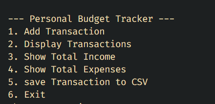

# 💰 BudgetTracker

Простой и удобный трекер личных финансов, написанный на Go.  
Храни, отслеживай и анализируй свои расходы и доходы — без лишнего шума.


---

## 🧩 Возможности

- 📌 Добавление доходов и расходов
- 📊 Просмотр общей статистики
- 🗃️ Хранение данных в SQLite
- 🚀 Быстрый и простой запуск

---

## ⚙️ Установка и запуск

> Убедись, что у тебя установлен Go версии 1.21 или выше

```bash
# Клонируй репозиторий
git clone https://github.com/IlyaMakar/BudgetTracker.git
cd BudgetTracker

# Собери и запусти
go run main.go
```

---

## 📁 Структура проекта

```bash
BudgetTracker/
├── database/       # Работа с SQLite
├── models/         # Структуры данных
├── handlers/       # Логика обработки команд
├── main.go         # Точка входа
├── go.mod          # Модули Go
```



---

## 🛠️ Технологии

- [Go](https://golang.org/) — язык разработки
- [SQLite](https://www.sqlite.org/) — база данных
- (В будущем) REST API или Web-интерфейс

---

## 💡 Планы на будущее

- 📱 Добавить веб-интерфейс
- 🌐 Сделать REST API
- ⏰ Поддержка регулярных транзакций
- 📦 Экспорт данных в CSV/JSON

---

## 🤝 Вклад

Буду рад любым идеям и предложениям!  
Открывай issue или делай pull request 🙌

---

## 📄 Лицензия

Проект распространяется под лицензией MIT.  
Подробнее см. файл [LICENSE](LICENSE).

---

## 👤 Автор

> Илья Макар  
[GitHub](https://github.com/IlyaMakar)

---

⭐️ Если проект тебе понравился — не забудь поставить звёздочку!
